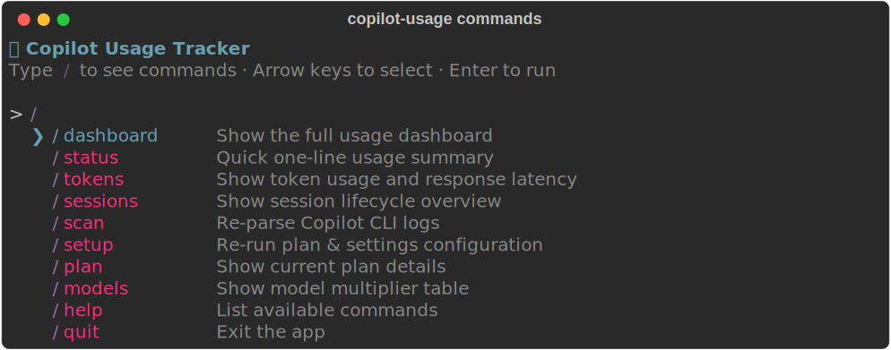
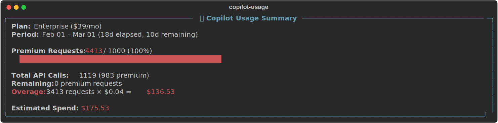
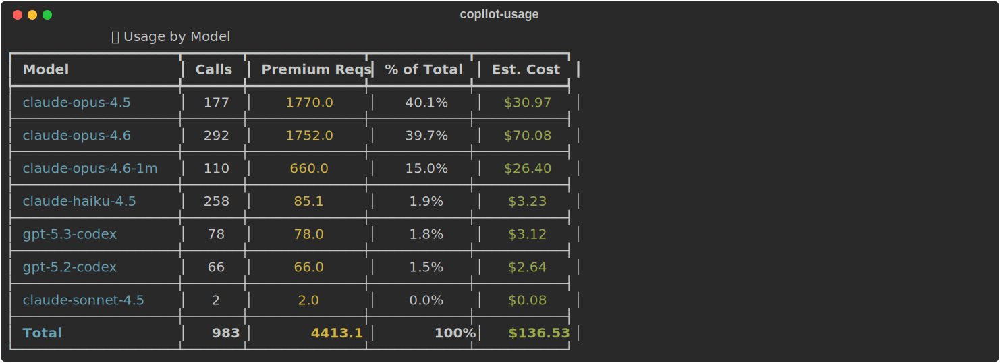
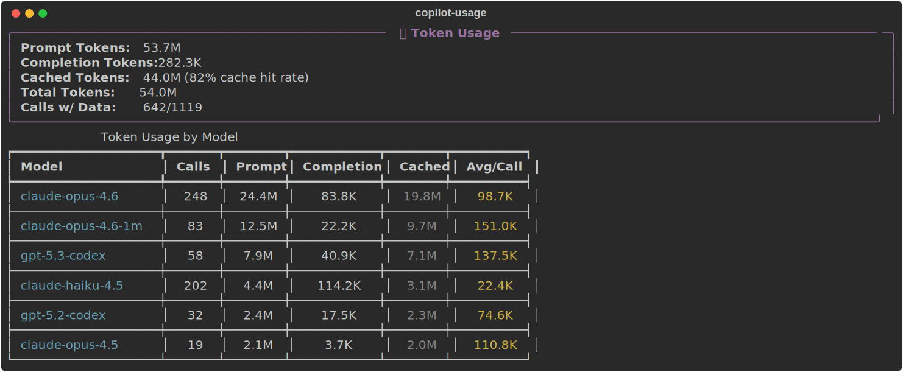
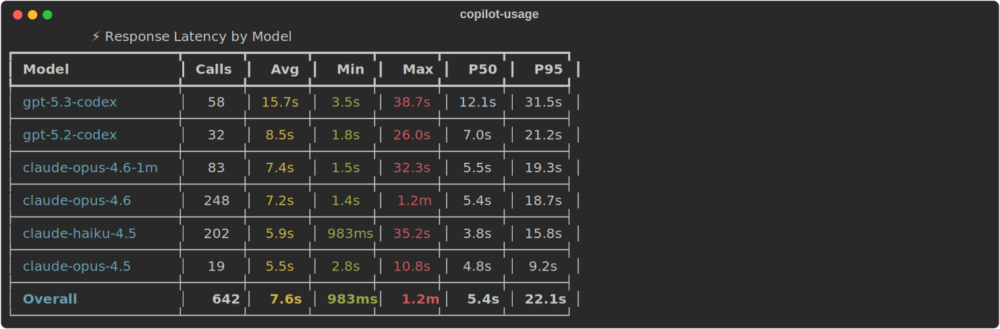
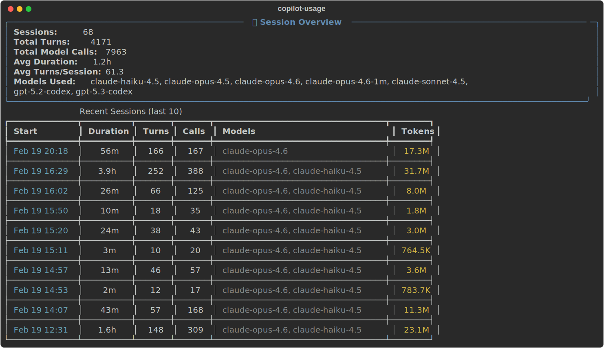
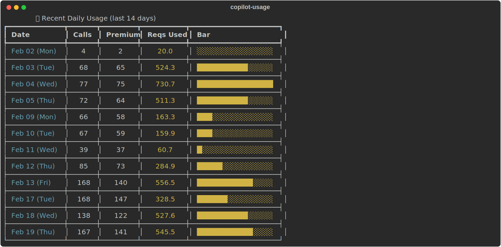
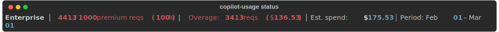

# Copilot Usage Tracker

[](https://github.com/rkemish/copilot-usage-tracker/actions/workflows/build-release.yml)

```
   ___            _ _       _     _   _                      
  / __\___  _ __ (_) | ___ | |_  | | | |___  __ _  __ _  ___ 
 / /  / _ \| '_ \| | |/ _ \| __| | | | / __|/ _` |/ _` |/ _ \
/ /__| (_) | |_) | | | (_) | |_  | |_| \__ \ (_| | (_| |  __/
\____/\___/| .__/|_|_|\___/ \__|  \___/|___/\__,_|\__, |\___|
           |_|                                    |___/       
  ⚡ Track premium requests · 💰 Estimate spend · 📊 Rich dashboard
```

A terminal app that tracks your GitHub Copilot premium request usage and estimated spend by parsing local CLI log files. Select your plan, see per-model cost breakdowns, and catch overages before they surprise you.

---

## ✨ Features

| Feature | Description |
|---------|-------------|
| 🔍 **Auto log parsing** | Reads `~/.copilot/logs/process-*.log` — extracts model, multiplier, premium status, tokens, latency |
| 💰 **Plan-aware billing** | Supports Free / Pro / Pro+ / Business / Enterprise with published pricing |
| 📈 **Chronological overage** | Processes requests in time order — included quota consumed first, overage attributed per-model |
| 🔤 **Token analytics** | Prompt, completion, and cached token counts per call with cache hit rate |
| ⚡ **Latency stats** | Per-model avg / min / max / P50 / P95 response times |
| 🔄 **Session tracking** | Session duration, turn counts, model switches, tokens per session |
| 🎯 **Interactive `/commands`** | Inline command picker — type `/` and select with arrow keys |
| 📦 **Standalone `.exe`** | Build with PyInstaller, no Python required |

---

## 🚀 Quick Start

```bash
# Install from source (Python 3.10+)
git clone https://github.com/rkemish/copilot-usage-tracker.git
cd copilot-usage
python -m venv .venv && .venv\Scripts\activate
pip install -e .

# Run — first launch auto-triggers setup + log scan
copilot-usage
```

Or download the standalone `copilot-usage.exe` from [Releases](https://github.com/rkemish/copilot-usage-tracker/releases).

---

## 🎮 Interactive Mode

Run `copilot-usage` with no arguments to enter interactive mode.
Type `/` to open the command picker — use ↑↓ arrows to navigate, Enter to select, or keep typing to filter:

<p align="center">
  
</p>

### Commands

| Command      | Shortcut | Description                          |
|--------------|----------|--------------------------------------|
| `/dashboard` | `/d`     | Full usage dashboard (6 panels)      |
| `/status`    | `/s`     | Quick one-line usage summary         |
| `/tokens`    | `/t`     | Token usage + response latency stats |
| `/sessions`  |          | Session lifecycle overview            |
| `/scan`      |          | Re-parse Copilot CLI logs            |
| `/setup`     |          | Change plan & settings               |
| `/plan`      | `/p`     | Show current plan details            |
| `/models`    | `/m`     | Show model multiplier table          |
| `/help`      | `/?`     | List available commands              |
| `/quit`      | `/q`     | Exit                                 |

### CLI Subcommands

```bash
copilot-usage setup        # Configure plan & settings
copilot-usage scan         # Parse new log files
copilot-usage scan --force # Re-parse everything
copilot-usage dashboard    # Full dashboard
copilot-usage status       # One-line summary
```

---

## 📊 Dashboard Panels

The `/dashboard` command renders six panels:

### Usage Summary
<p align="center">
  
</p>

### Usage by Model
<p align="center">
  
</p>

### Token Analytics
<p align="center">
  
</p>

### Response Latency
<p align="center">
  
</p>

### Session Overview
<p align="center">
  
</p>

### Weekly & Daily Breakdown
<p align="center">
  
</p>
<p align="center">
  
</p>

### Quick Status
<p align="center">
  
</p>

---

## ⚙️ Setup & Configuration

On first run (or via `/setup`), the app walks you through:

1. **Select your Copilot plan** — Free, Pro, Pro+, Business, or Enterprise
2. **Review model multipliers** — accept published defaults or override per-model
3. **Set billing cycle start day** — aligns views to your actual billing period (1–28)
4. **Confirm log directory** — defaults to `~/.copilot/logs/`

Config saved to `~/.copilot-usage/config.yaml`. Usage data cached in `~/.copilot-usage/usage.db`.

---

## 💰 Plans & Pricing

| Plan       | Price/mo | Included Premium Reqs | Overage Rate |
|------------|----------|-----------------------|--------------|
| Free       | $0       | 50                    | N/A          |
| Pro        | $10      | 300                   | $0.04/req    |
| Pro+       | $39      | 1,500                 | $0.04/req    |
| Business   | $19      | 300/user              | $0.04/req    |
| Enterprise | $39      | 1,000/user            | $0.04/req    |

## 🔢 Model Multipliers

Each model call consumes a different number of premium requests:

| Model | Multiplier | | Model | Multiplier |
|-------|------------|--|-------|------------|
| GPT-4o / 4.1 | 0× (free) | | Claude Sonnet 4–4.6 | 1× |
| GPT-5 mini | 0× (free) | | Gemini 2.5 / 3 / 3.1 Pro | 1× |
| Raptor mini | 0× (free) | | GPT-5.x Codex | 1× |
| Grok Code Fast 1 | 0.25× | | GPT-5.1 Codex Max | 1× |
| Gemini 3 Flash | 0.33× | | Claude Opus 4.5 / 4.6 | 3× |
| GPT-5.1 Codex Mini | 0.33× | | Claude Opus 4.6 (1M) | 3× |
| Claude Haiku 4.5 | 0.33× | | Claude Opus 4.6 (fast) | 30× |

Override any multiplier during `/setup`. View active values with `/models`.

---

## 🔧 How It Works

```
~/.copilot/logs/process-*.log
         │
         ▼
   ┌─────────────┐     ┌──────────────┐     ┌────────────────┐
   │  Log Parser  │────▶│  SQLite DB   │────▶│  Calculator    │
   │              │     │  (cache)     │     │  (chronological│
   │ • model info │     │              │     │   billing)     │
   │ • tokens     │     │ usage_records│     │                │
   │ • latency    │     │ sessions     │     │ • included     │
   │ • sessions   │     │ parsed_files │     │ • overage      │
   └─────────────┘     └──────────────┘     │ • per-model    │
                                             └───────┬────────┘
                                                     │
                                                     ▼
                                            ┌────────────────┐
                                            │ Rich Dashboard │
                                            │  (6 panels)    │
                                            └────────────────┘
```

**Log format parsed:**
```
Got model info: {
  "billing": { "is_premium": true, "multiplier": 6 },
  "capabilities": { "family": "claude-opus-4.6" }
}
```

**Telemetry extracted:**
```
[Telemetry] cli.model_call: {
  "model": "claude-opus-4.6",
  "prompt_tokens_count": 85000,
  "completion_tokens_count": 1200,
  "cached_tokens_count": 70000,
  "duration_ms": 5400,
  "session_id": "abc-123"
}
```

---

## 📁 Project Structure

```
copilot-usage/
├── pyproject.toml                # Project config & deps
├── requirements.txt              # Pinned versions
├── src/copilot_usage/
│   ├── __init__.py
│   ├── __main__.py               # Entry point (python -m / PyInstaller)
│   ├── cli.py                    # Click CLI with subcommands
│   ├── interactive.py            # REPL with /commands + inline picker
│   ├── onboarding.py             # First-run setup wizard
│   ├── config.py                 # YAML config load/save
│   ├── plans.py                  # Plan definitions & multiplier table
│   ├── models.py                 # Dataclasses (UsageRecord, SessionRecord, etc.)
│   ├── log_parser.py             # Copilot CLI log file parser
│   ├── storage.py                # SQLite persistence + schema migration
│   ├── calculator.py             # Chronological spend calculation
│   └── dashboard.py              # Rich terminal panels (6 views)
├── tests/
│   ├── test_log_parser.py
│   └── test_calculator.py
└── dist/
    └── copilot-usage.exe         # Standalone executable (13 MB)
```

## 🏗️ Building the Executable

```bash
pip install pyinstaller
pyinstaller --onefile --name copilot-usage --collect-all rich --hidden-import pyreadline3 src/copilot_usage/__main__.py
# Output: dist/copilot-usage.exe (~13 MB)
```

---

## License

MIT
